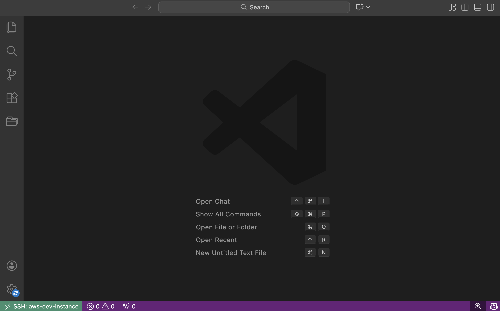

# Remote SSH on VSCode - AWS Entry Point

This directory is the operational entry point for AWS workflows. The Terraform module lives in `aws/linux/terraform/`, and the Ansible configuration lives in `aws/linux/ansible/`.

## Features

- 🚀 **VS Code Server** pre-installed and configured
- 💰 **Spot instance support** with fallback to on-demand
- 🔒 **Automatic IP detection** for SSH security group
- 🔄 **IAM roles** with the specified policies
- 💾 **EBS data volume** with gp3 type
- 💽 **Daily backup** with 7-day retention (configurable)
- 📦 **User data script** to mount the data volume automatically
- 🎯 **Proper outputs** including SSH connection command

## Prerequisites

- [Terraform](https://www.terraform.io/downloads) >= 1.14.0
- AWS CLI configured with appropriate credentials
- Existing EC2 key pair in your AWS account or create a new one using `just create-ssh-key`

## Resources Created

- EC2 Instance (Amazon Linux 2023) with t3.micro instance type (Spot Instance enabled for cost optimization)
- EBS Data Volume (50GB gp3)
- Security Group (SSH access from your IP for security reasons)
- IAM Role with EC2 and SSM permissions
- Optional: Daily EBS snapshots with 7-day retention (Spot instance may be terminated, so snapshots are stored for cost optimization)

## Just Recipes

A few recipes are provided for quick provisioning and cleanup.

1. Change into the `aws/` directory.
2. Run `just <recipe>` directly from there. The default OS target is `linux`.
3. To target a specific OS module, use `just <recipe> <os>`, for example `just init ubuntu`.

Common recipes:

- `just pre-check` / `just pre-check linux`
- `just init` / `just init linux`
- `just plan` / `just plan linux`
- `just apply` / `just apply linux`
- `just plan-apply` / `just plan-apply linux`
- `just destroy` / `just destroy linux`
- `just destroy-apply` / `just destroy-apply linux`
- `just ssh-connect` / `just ssh-connect linux`
- `just add-ssh-config` / `just add-ssh-config linux`
- `just update-ssh-ip` / `just update-ssh-ip linux`
- `just ansible-ping` / `just ansible-ping linux`
- `just ansible-bootstrap` / `just ansible-bootstrap linux`

## Infra Provisioning Steps

1. Update values in `linux/terraform/variables.tf` or inject `TF_VAR_<variable_name>` environment variables when needed.
2. Initialize Terraform using `just init` or `just init linux`.
3. Review the execution plan using `just plan` or `just plan linux`.
4. Apply the configuration using `just apply` / `just plan-apply`.
5. Connect to your instance using the SSH command from `just ssh-connect`, and copy the command to your clipboard. Run the command in your terminal to connect to the instance. You will be prompted to accept the host key. Type `yes` and press Enter. A view as below will be displayed when the connection is successful.

    ```text
    ,     #_
    ~\_  ####_        Amazon Linux 2023
    ~~  \_#####\
    ~~     \###|
    ~~       \#/ ___   https://aws.amazon.com/linux/amazon-linux-2023
    ~~       V~' '->
        ~~~         /
        ~~._.   _/
            _/ _/
        _/m/'
    ```

Now, you can close the connection from terminal, and use VSCode to connect to the instance.

## Setup SSH Config for Remote Connection

1. First of all, you should have installed the "Remote - SSH" extension in VSCode.
2. Make sure you have the pem-key file in `~/.ssh/` directory. The default file name is `aws-remote-ssh-on-vscode.pem`.
3. Run `just add-ssh-config` to add the SSH host entry to ~/.ssh/config.
4. Open VSCode, and click on the "Open a remote window" icon in the bottom left corner. You will see a dropdown menu. Choose "Connect to Host" from the menu. Select "aws-dev-instance". A new VSCode window will be opened with the instance as the remote host after the connection is successful.
5. The green bar on the bottom left corner of VSCode will display "SSH: aws-dev-instance" which indicates the connection is successful.
    

Now, you can take the journey of remote development with VSCode.

> **Note**: For security concerns, Currently the SSH access is only allowed from your current IP. You can update the security group rule for SSH access using `just update-ssh-ip` when you need to access the instance from a different IP.

`just update-ssh-ip` locates the single Terraform-managed IPv4 ingress rule for
TCP/22 with the description `SSH access` and updates that rule atomically. It
refuses to modify the security group when no rule or multiple rules match; in
that case, update `allowed_ssh_cidr_blocks` through Terraform instead.

## Clean Up

- Remove the SSH host entry from ~/.ssh/config if you no longer need it.
- Destroy the Terraform resources:

    ```bash
    just destroy
    just apply
    ```

> Note: This will delete all resources including EBS snapshots.
